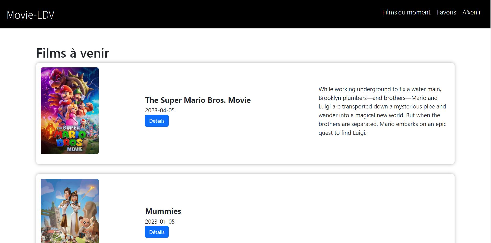
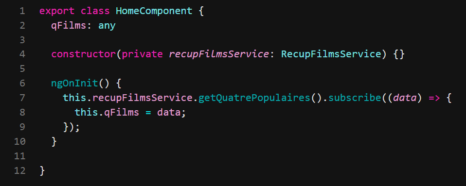
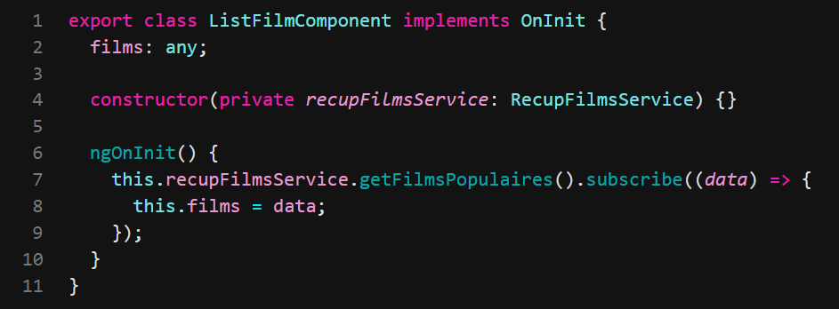
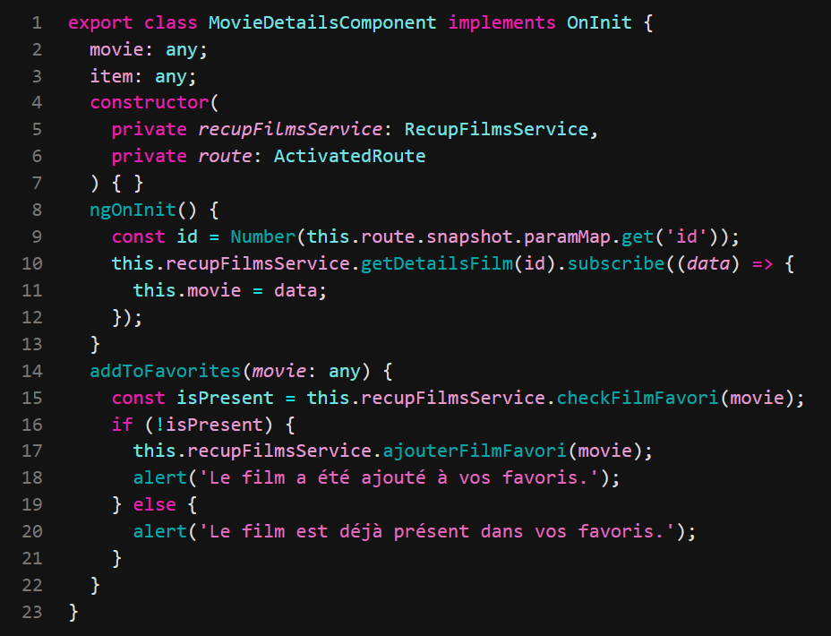
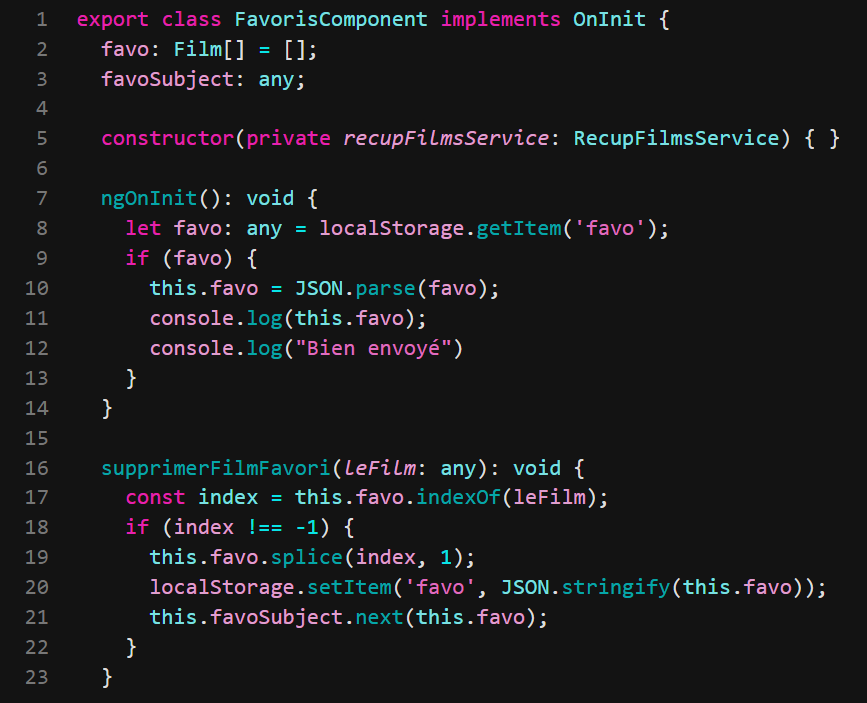
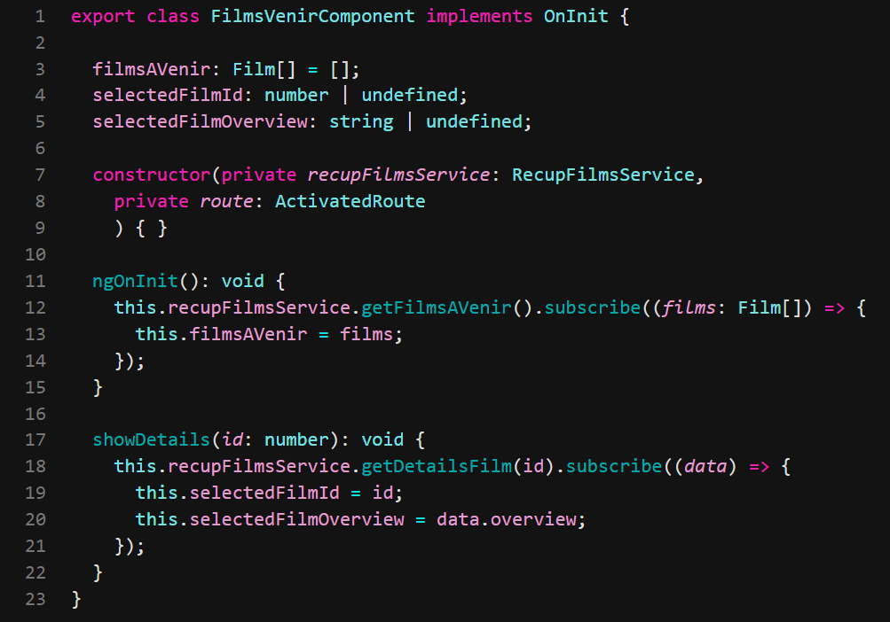
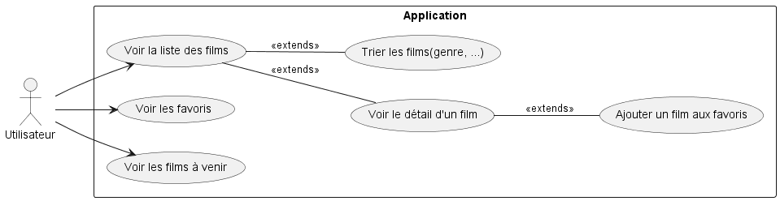
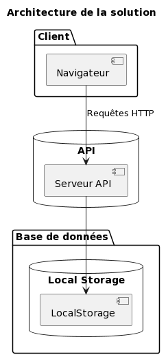

= MovieLDV
:author: Tabar Labonne Baptiste et Laroui Chakib
:docdate: 2023-04-10
:description: Projet FilmLDV
:toc: left
:toclevels: 5

== Présentation
Ce projet consiste en une application front-end pour la consultation de films populaire, à venir ou autre. Elle utilise le framework Angular et une API distante pour présenter les différents films.

== Fonctionnalités
- Affichage des films populaires : L'application affiche une liste de films populaires basés sur une API.
- Tri de films : Les films peuvent être triés par genre, acteur, popularité, etc.
- Affichage de la description du film : En cliquant sur un film, l'application affiche une description du film.
- Affichage des films à venir et des films à l'affiche : L'application affiche les films qui sont actuellement à l'affiche dans les cinémas et ceux qui sortiront bientôt.
- Enregistrement de films préférés : L'utilisateur peut enregistrer les films qu'il souhaite voir ultérieurement et consulter cette liste à tout moment.

== Utilisation
====
Lorsque vous accédez à l'application, vous êtes redirigé vers la page d'accueil où vous trouverez une présentation du projet. Il est présenté une liste de 4 films les plus populaires. Pour consulter les films du moment, cliquez sur "Films populaire" dans la barre de navigation.

====

====
Sur la page "Films popualire", vous verrez la liste des films populaire. Pour voir les détails d'un film, cliquez sur "Voir détails"

====

====
Sur la page "Film à venir", vous verrez la liste des films à venir. Vous pouvez aussi voir les détails d'un film en cliquant sur "Voir détails"

====

====
Sur la page "Voir détails", vous verrez les informations détaillées du film sélectionné (description, date de sortie, recette...). 
Vous pourrez également ajouter ce film à vos favoris en cliquant sur le bouton "Ajouter aux favoris".

====

====
Sur la page "Favoris", vous verrez les films que vous avez ajoutés ainsi que leurs date de sortie, et une image. En appuyant sur le bouton "Desciption" vous avez accès à la description du film
Vous pouvez également supprimer un film de vos favoris

====

== Codes
=== Home

=== Films populaire

=== Détails Films

=== Favoris

=== Films à venir

== Diagramme
=== Diagramme d'utilisation

=== Diagramme des tiers

== Structure JSON
[source,json]
====
[source,json]
----
{
  "adult": false,
  "backdrop_path": "/hZkgoQYus5vegHoetLkCJzb17zJ.jpg",
  "belongs_to_collection": null,
  "budget": 63000000,
  "genres": [
    {
      "id": 18,
      "name": "Drama"
    },
    {
      "id": 53,
      "name": "Thriller"
    },
    {
      "id": 35,
      "name": "Comedy"
    }
  ],
  "homepage": "http://www.foxmovies.com/movies/fight-club",
  "id": 550,
  "imdb_id": "tt0137523",
  "original_language": "en",
  "original_title": "Fight Club",
  "overview": "A ticking-time-bomb insomniac and a slippery soap salesman channel primal male aggression into a shocking new form of therapy. Their concept catches on, with underground \"fight clubs\" forming in every town, until an eccentric gets in the way and ignites an out-of-control spiral toward oblivion.",
  "popularity": 71.385,
  "poster_path": "/pB8BM7pdSp6B6Ih7QZ4DrQ3PmJK.jpg",
  "production_companies": [
    {
      "id": 508,
      "logo_path": "/7cxRWzi4LsVm4Utfpr1hfARNurT.png",
      "name": "Regency Enterprises",
      "origin_country": "US"
    },
    {
      "id": 711,
      "logo_path": "/tEiIH5QesdheJmDAqQwvtN60727.png",
      "name": "Fox 2000 Pictures",
      "origin_country": "US"
    },
    {
      "id": 20555,
      "logo_path": "/hD8yEGUBlHOcfHYbujp71vD8gZp.png",
      "name": "Taurus Film",
      "origin_country": "DE"
    },
    {
      "id": 54051,
      "logo_path": null,
      "name": "Atman Entertainment",
      "origin_country": ""
    },
    {
      "id": 54052,
      "logo_path": null,
      "name": "Knickerbocker Films",
      "origin_country": "US"
    },
    {
      "id": 4700,
      "logo_path": "/A32wmjrs9Psf4zw0uaixF0GXfxq.png",
      "name": "The Linson Company",
      "origin_country": "US"
    },
    {
      "id": 25,
      "logo_path": "/qZCc1lty5FzX30aOCVRBLzaVmcp.png",
      "name": "20th Century Fox",
      "origin_country": "US"
    }
  ],
  "production_countries": [
    {
      "iso_3166_1": "US",
      "name": "United States of America"
    }
  ],
  "release_date": "1999-10-15",
  "revenue": 100853753,
  "runtime": 139,
  "spoken_languages": [
    {
      "english_name": "English",
      "iso_639_1": "en",
      "name": "English"
    }
  ],
  "status": "Released",
  "tagline": "Mischief. Mayhem. Soap.",
  "title": "Fight Club",
  "video": false,
  "vote_average": 8.432,
  "vote_count": 26207
}

----
====

== Cybersécurité
- Panne de l'API : Si l'API que j'utilise pour récupérer les données de films est en panne, cela pourrait affecter l'affichage des films sur mon site et empêcher les utilisateurs d'accéder aux informations qu'ils recherchent.

- Changements de l'API : Si l'API que j'utilise subit des changements, cela pourrait avoir un impact sur le fonctionnement de mon site. Par exemple, si l'API change la façon dont elle renvoie les données, cela pourrait entraîner des erreurs sur mon site.

- Erreurs de codage : Les erreurs de codage peuvent causer des problèmes de fonctionnement sur mon site, entraînant des erreurs de page ou des temps de chargement plus longs. Il est important de tester et de déboguer mon code pour éviter ces problèmes.

- Capacité du serveur : Si mon site connaît une augmentation soudaine de trafic, cela pourrait causer des temps de chargement plus longs ou même des plantages. Je dois m'assurer que mon serveur est capable de gérer la charge de trafic prévue pour mon site.

== Technologies utilisées
Angular 13,
TypeScript,
HTML/CSS,
Bootstrap,
RxJS.

== Contributeurs
TABAR LABONNE Baptiste et LAROUI Chakib